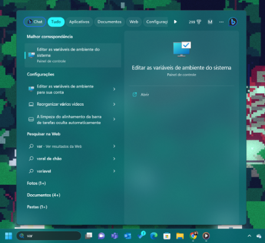
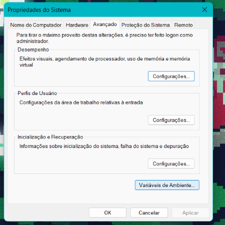
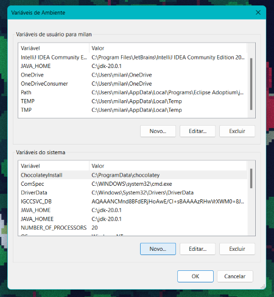
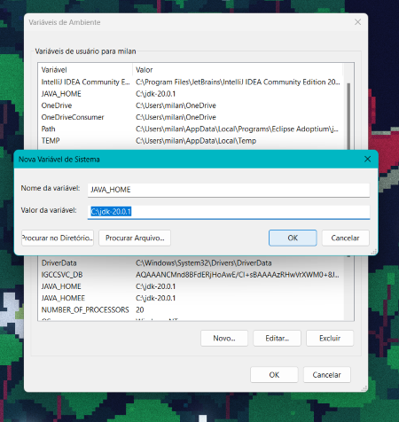
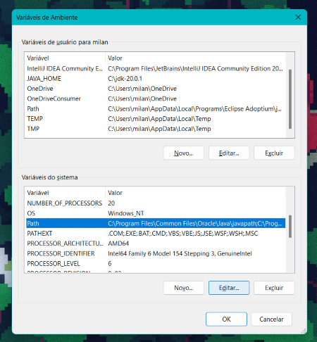
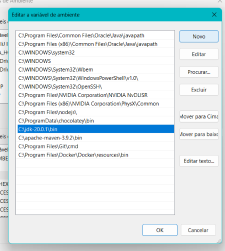

## Esse repositório tem como objetivo trazer um projeto de automação para a API Simulações de Credito.

Esse projeto é realizado por Higor Milani pelo programa de bolsas da [Compass.UOL](https://compass.uol/en/about-us/) em Automação de Testes em Java Back-end.

A fim de agregar valor na aplicação esse projeto consta com uma vasta documentação disponível em [Documentação](https://docs.google.com/document/d/1V4Ivsur7kMg_KByYb0foMhyQZ419nKII07iXW0mnAxo/edit?usp=sharing)
Esse projeto possui um código de automação escrito em JAVA utilizando ferramentas com RestAssured, um Plano de testes com informações sobre a API, casos de testes, DoR, DoD, User Stories, Acceptance Criteria, Mapa Mental da API, Documentação da API e seu repositório, Issues, Bugs e Melhorias levantadas. 

## Requisições e ferramentas

Instalados na maquina a ser executada.
- [Java +8](https://www.oracle.com/java/technologies/downloads/#java20)
- [Maven](https://maven.apache.org/download.cgi)

## Como configura as Variaveis de ambiente?

1. Pesquise por “variaveis” na barra de busca do Windows e selecione Editar as variáveis de ambiente do sistema:



2. Clique em Variáveis de Ambiente…



3. Em Variáveis do sistema (caso não tenha permissões de admin, realize os próximos passos em Variáveis do usuário…), clique em Novo…



4. Na janela que abrir preencha os dados e clique em OK como na imagem a seguir. Utilize o caminho do seu computador onde instalou o JDK (aqui não colocamos a pasta bin junto).



5. Encontre e selecione a variável Path, em seguida clique em Editar…



6. Na janela que abrir, clique em novo:



7. Adicione ambos os caminhos: C:\apache-maven-3.8.6\bin e C:\jdk-18.0.2\bin . Lembrando que devem ser os caminhos que você instalou em sua máquina!

8. Clique em OK até sair de todas as janelas abertas pela configuração de variáveis!


Caso tenha duvidas consulte https://www.baeldung.com/install-maven-on-windows-linux-mac

## Como executar a API Localmente?
Para executar a API localmente você pode baixa-la em: [Desafio Sicredi GitHub](https://github.com/desafios-qa-automacao/desafio-sicredi/tree/master)

E na pasta Raiz do projeto (\desafio-sicredi\prova-tecnica-api) abrir o terminal e executar os seguintes comandos:
```
mvn clean spring-boot:run
```
Assim a API estará executando por padrão na porta 8080
caso seja necessario mudar a porta use esse comando abaixo em vez do de cima:
(em vez de 8888 voce pode usar a porta desejada)
```
mvn clean spring-boot:run -Dserver.port=8888
```
Assim que a API estejá executando voce pode consultar o Swagger em : http://localhost:8080/swagger-ui.html#

Caso você encontre um erro ao executar a API tente mudar a Versão do lombok em: \desafio-sicredi\prova-tecnica-api\pom.xml
na linha 55 mude de <version>1.18.8</version> para <version>1.18.28</version> e execute mvn clean spring-boot:run novamente
(Mais sobre esse problema em: https://gitlab.com/higor_sprints/challenge-final-sprint-6/-/issues/1 )

## Como Executar os Testes?
Para executar os localmente você pode baixar esse repositório, abrir a pasta Raiz e executar o comando:

Executa os códigos
```
 mvn test -Denv=local
``` 
Gera o report dos testes executados
```
mvn allure:report
``` 
Sobe um servidor com os reports com gráficos e outras informações sobre os testes
```
mvn allure:serve
```

(Em caso de duvidas consultar a documentação do Allure [Aqui](https://github.com/allure-framework/allure2/releases) )

## Links 

[Plano de Testes](https://gitlab.com/higor_sprints/challenge-final-sprint-6/-/blob/develop/Plano%20de%20Testes/Plano%20de%20Testes.md?ref_type=heads)

[Repositório dos testes automatizados](https://gitlab.com/higor_sprints/challenge-final-sprint-6)

[Repositório da API](https://github.com/desafios-qa-automacao/desafio-sicredi)


## Agradecimentos
- Obrigado a Compass UOL pela oportunidade
- Obrigado Rafael e Jacques pelas mentorias 
- Obrigado ao time de bolsas pelo auxilio
- Obrigado ao Guilherme pelas ajudas com os asserts e códigos
- Obrigado a todos os meus colegas na bolsa de estudos por me ajudarem nessa trilha, obrigado por disponibilizar o tempo e a simpatia pela equipe.


